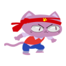
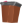

#  Repo para HotSale 

**Desarrollado en 18 horas por el grupo "4 Pintas" para la Eterjam 2019.**

###  Página del juego:
[https://remruts.itch.io/hotsale](https://remruts.itch.io/hotsale)

###  Licencia
El código debería ser libre, salvo cosas como Yarn Spinner que no es nuestro, tiene su propia licencia y ni siquiera se usa en el juego. El arte (por Emilia Calvo) y música (por Martín Altman y Fabricio Previgliano) también serían libres, aunque estaría bueno dar crédito.

Los sonidos no tengo idea la licencia, así que yo no me arriesgaría. Y la fuente Roboto es de Google, pero deberían poder usarla.

###  Equipo:
- Emilia Calvo (Arte)
- Martin Altman (Música/Programación)
- Fabricio Previgliano (Música/Programación)
- Giuliano Francisco Vitteli (Programación)
- Andreas Sturmer (Programación)

El diseño del juego fue un trabajo en conjunto y los roles de dirección, etc. fueron rotando.

 

